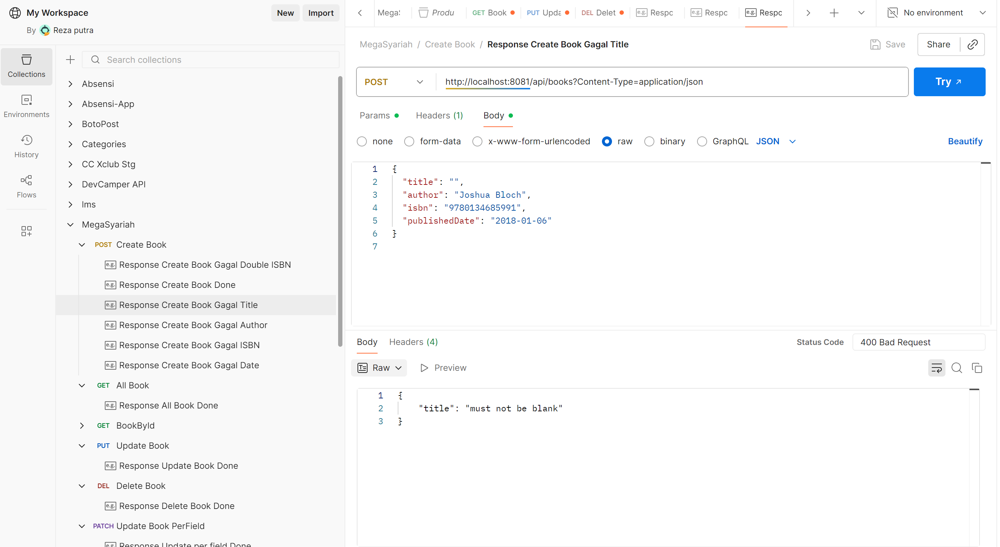
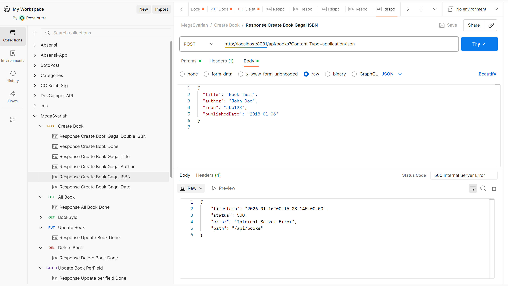
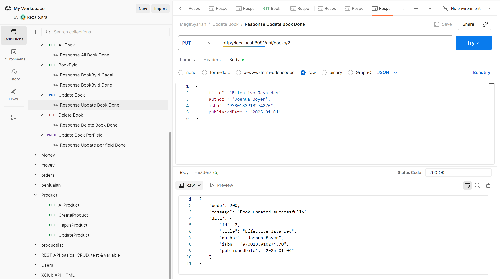
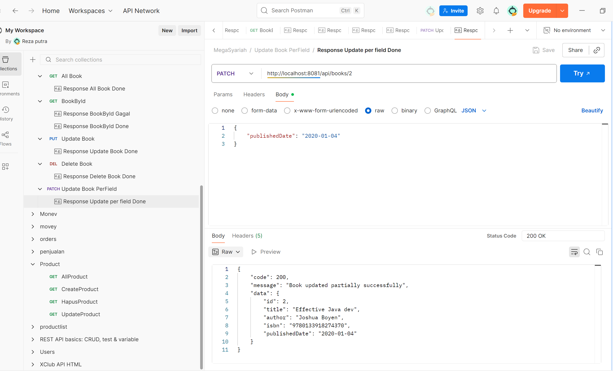
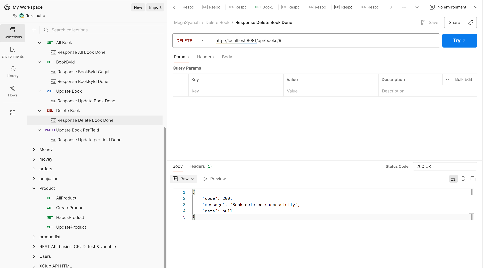
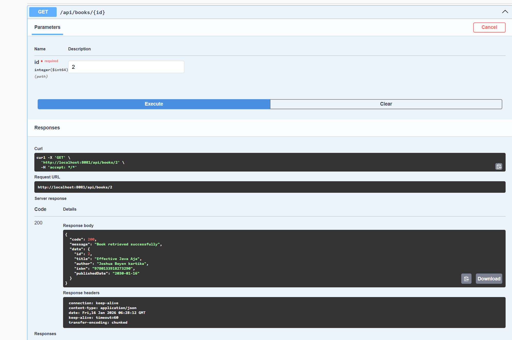
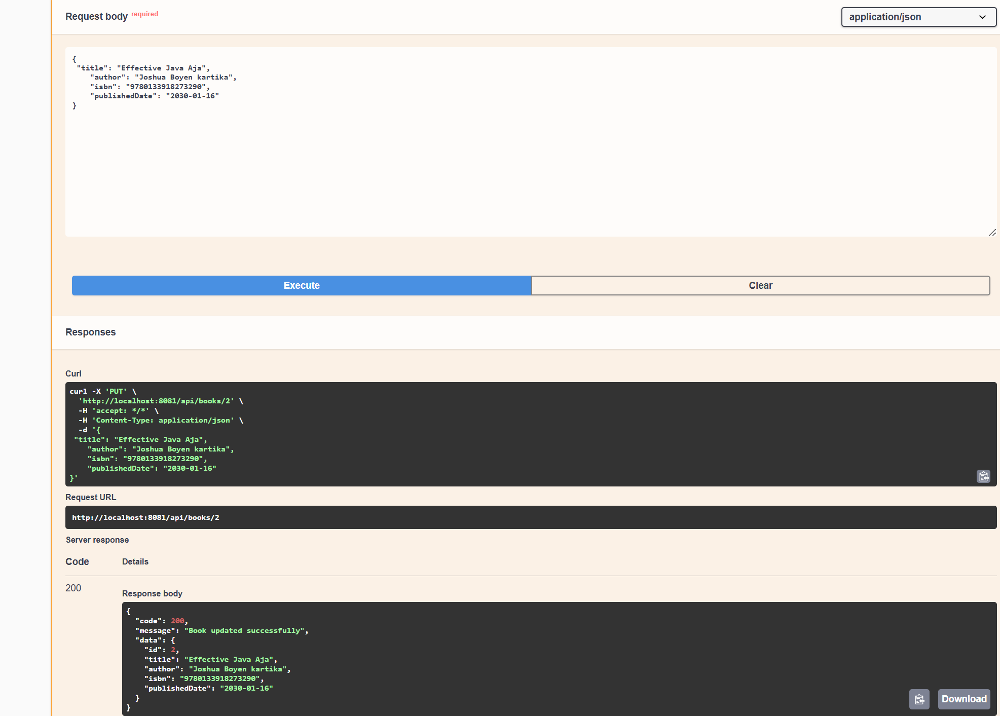
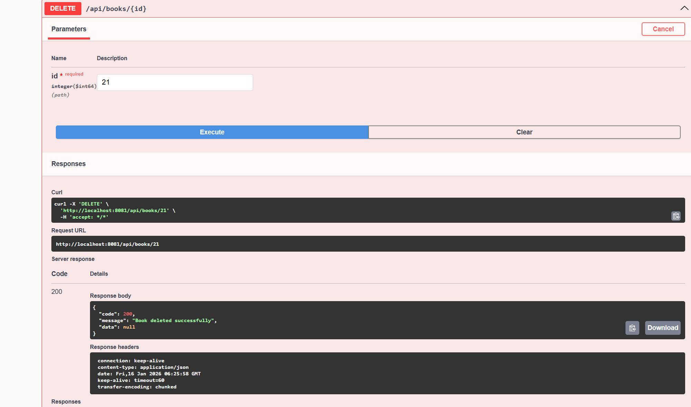

Simple Book Management Microservice
<table> <tr> <td align="center"><b>Step</b></td> <td align="center"><b>Perintah / Link</b></td> </tr> <tr> <td>Clone Repository</td> <td><code>git clone &lt;repo-url&gt;</code></td> </tr> <tr> <td>Jalankan Aplikasi</td> <td><code>mvn spring-boot:run</code></td> </tr> <tr> <td>Swagger UI</td> <td><a href="http://localhost:8081/swagger-ui/index.html">http://localhost:8081/swagger-ui/index.html</a></td> </tr> <tr> <td>Postman Collection</td> <td><a href="https://www.postman.com/cryosat-technologist-82314506/workspace/my-workspace/collection/29178897-3659d1f4-a5a2-4cba-a41d-d545ea9fb370?action=share&creator=29178897">Postman Collection Link</a></td> </tr> </table>

## 🧱 Design Decisions
- Single Entity Design: Only Book entity for simplicity
- Database Choice: PostgreSQL for production-ready persistence
- API Response Format: Consistent {code, message, data} structure
- Validation Layer: Built-in and custom validations for business rules

📌 Prerequisites
- ✅ Java JDK 17.0.17 or newer
- ✅ Maven 3.9.11
- ✅ PostgreSQL
- ✅ Git (optional)
- ✅ Postman
- ✅ Swagger

## 🗄️ Database Configuration
# sql
- Create database
CREATE DATABASE book_db;
## ⚙️ Application Configuration
yaml
server:
  port: 8081

spring:
  application:
    name: book-service
  
  datasource:
    url: jdbc:postgresql://localhost:5432/book_db
    username: postgres
    password: password
    driver-class-name: org.postgresql.Driver
  
  jpa:
    hibernate:
      ddl-auto: update
    show-sql: true
    properties:
      hibernate:
        format_sql: true
        dialect: org.hibernate.dialect.PostgreSQLDialect
## 🚀 Run the Application
# bash
- mvn spring-boot:run
# 🔧 Postman Environment Variables
- text
- DB_URL=jdbc:postgresql://localhost:5432/book_db
- DB_USERNAME=postgres
- DB_PASSWORD=password
## 📚 API Documentation
## 📖 BOOK MANAGEMENT
<table> <tr> <th>Method</th> <th>Endpoint</th> <th>Description</th> <th>Status Codes</th> </tr> <tr> <td><b>POST</b></td> <td><code>/api/books</code></td> <td>Create new book</td> <td>201, 400, 409</td> </tr> <tr> <td><b>GET</b></td> <td><code>/api/books</code></td> <td>Get all books</td> <td>200, 404</td> </tr> <tr> <td><b>GET</b></td> <td><code>/api/books/{id}</code></td> <td>Get book by ID</td> <td>200, 404</td> </tr> <tr> <td><b>PUT</b></td> <td><code>/api/books/{id}</code></td> <td>Update all book data</td> <td>200, 400, 404</td> </tr> <tr> <td><b>PATCH</b></td> <td><code>/api/books/{id}</code></td> <td>Update partial book data</td> <td>200, 400, 404</td> </tr> <tr> <td><b>DELETE</b></td> <td><code>/api/books/{id}</code></td> <td>Delete book</td> <td>200, 404</td> </tr> </table>

## 🏗️ Database Design
## 📊 ER Diagram
# text
```sql
+----------------------+
|        BOOKS         |
+----------------------+
| PK id : BIGINT       |
| title : VARCHAR      |
| author : VARCHAR     |
| isbn : VARCHAR (UQ)  |
| published_date : DATE|
+----------------------+
```
## ⚖️ Validation & Business Rules
- ✅ All fields are required for CREATE & PUT operations
- ✅ ISBN must be unique across all books
- ✅ ISBN must contain digits only (numeric validation)
- ✅ Author name cannot contain numbers (alphabetical validation)
- ✅ Date format must be yyyy-MM-dd (ISO date format)

## 🛠️ Tech Stack
<table> <tr> <td><b>Backend</b></td> <td>Java 11, Spring Boot, Spring Data JPA</td> </tr> <tr> <td><b>Database</b></td> <td>PostgreSQL</td> </tr> <tr> <td><b>Build Tool</b></td> <td>Maven</td> </tr> <tr> <td><b>Documentation</b></td> <td>Swagger OpenAPI</td> </tr> <tr> <td><b>Testing</b></td> <td>Postman, Swagger UI</td> </tr> </table>

## 📋 Sample API Requests & Responses
# ➕ POST /api/books - Create Book
# Request:
```json
{
  "title": "Clean Code",
  "author": "Robert C Martin",
  "isbn": "9780132350884",
  "publishedDate": "2008-08-01"
}
```
# Response (201 Created):
```json
{
  "code": 201,
  "message": "Book created successfully",
  "data": {
    "id": 1,
    "title": "Clean Code",
    "author": "Robert C Martin",
    "isbn": "9780132350884",
    "publishedDate": "2008-08-01"
  }
}
```
## 🔍 GET /api/books/1 - Get Book by ID
# Response (200 OK):
```json
{
  "code": 200,
  "message": "Book retrieved successfully",
  "data": {
    "id": 1,
    "title": "Clean Code",
    "author": "Robert C Martin",
    "isbn": "9780132350884",
    "publishedDate": "2008-08-01"
  }
}
```
## 🔄 PATCH /api/books/1 - Partial Update
# Request:
```json
{
  "author": "Uncle Bob"
}
```
## 🗑️ DELETE /api/books/1 - Delete Book
# Response (200 OK):
```json
{
  "code": 200,
  "message": "Book deleted successfully",
  "data": null
}
```

## 📸 Postman Test Results

### ➕ CREATE Operations (POST /api/books)

<div align="center">
  <table>
    <tr>
      <td align="center"><b>Response Berhasil Create</b></td>
      <td align="center"><b>Response Gagal - Author</b></td>
      <td align="center"><b>Response Gagal - Date</b></td>
    </tr>
    <tr>
      <td></td>
      <td></td>
      <td></td>
    </tr>
    <tr>
      <td align="center"><b>Response Gagal - Double ISBN</b></td>
      <td align="center"><b>Response Gagal - Title</b></td>
      <td align="center"><b>Response Gagal - ISBN</b></td>
    </tr>
    <tr>
      <td></td>
      <td></td>
      <td></td>
    </tr>
  </table>
</div>

### 🔍 READ Operations (GET /api/books)

<div align="center">
  <table>
    <tr>
      <td align="center"><b>Response All Book</b></td>
      <td align="center"><b>Response Berhasil Book By ID</b></td>
      <td align="center"><b>Response Gagal Book By ID</b></td>
    </tr>
    <tr>
      <td></td>
      <td></td>
      <td></td>
    </tr>
  </table>
</div>

### ✏️ UPDATE Operations

<div align="center">
  <table>
    <tr>
      <td align="center"><b>PUT - Response Berhasil Update</b></td>
      <td align="center"><b>PATCH - Response Berhasil Update By Field</b></td>
    </tr>
    <tr>
      <td></td>
      <td></td>
    </tr>
  </table>
</div>

### 🗑️ DELETE Operation (DELETE /api/books/{id})

<div align="center">
  <table>
    <tr>
      <td align="center"><b>Response Berhasil Delete</b></td>
    </tr>
    <tr>
      <td></td>
    </tr>
  </table>
</div>

## 📘 Swagger UI Test Results

### 🔍 GET Operations

<div align="center">
  <table>
    <tr>
      <td align="center"><b>Response All Book</b></td>
      <td align="center"><b>Response Get By Id</b></td>
    </tr>
    <tr>
      <td></td>
      <td></td>
    </tr>
  </table>
</div>

### ➕ POST Operation (Create)

<div align="center">
  <table>
    <tr>
      <td align="center"><b>Response Create Book</b></td>
    </tr>
    <tr>
      <td></td>
    </tr>
  </table>
</div>

### ✏️ UPDATE Operations

<div align="center">
  <table>
    <tr>
      <td align="center"><b>PATCH - Response Update By Field</b></td>
      <td align="center"><b>PUT - Response Update</b></td>
    </tr>
    <tr>
      <td></td>
      <td></td>
    </tr>
  </table>
</div>

### 🗑️ DELETE Operation

<div align="center">
  <table>
    <tr>
      <td align="center"><b>Response Delete Book</b></td>
    </tr>
    <tr>
      <td></td>
    </tr>
  </table>
</div>

## 📊 API Testing Summary Table

<div align="center">
  <table border="1" cellpadding="8" cellspacing="0" style="border-collapse: collapse;">
    <tr style="background-color: #f2f2f2;">
      <th align="center" width="150">Operation</th>
      <th align="center" width="250">Endpoint</th>
      <th align="center" width="300">Test Cases</th>
      <th align="center" width="100">Status</th>
      <th align="center" width="100">Images</th>
    </tr>
    <tr>
      <td align="center"><b>CREATE</b></td>
      <td align="center">POST /api/books</td>
      <td>
        • Success create book ✓<br>
        • Invalid author (contains numbers) ✗<br>
        • Invalid date format ✗<br>
        • Duplicate ISBN ✗<br>
        • Empty title ✗<br>
        • Invalid ISBN format ✗
      </td>
      <td align="center" style="color: green;">✅ 6/6</td>
      <td align="center">6 images</td>
    </tr>
    <tr>
      <td align="center"><b>READ ALL</b></td>
      <td align="center">GET /api/books</td>
      <td>• Get all books successfully ✓</td>
      <td align="center" style="color: green;">✅ 1/1</td>
      <td align="center">1 image</td>
    </tr>
    <tr>
      <td align="center"><b>READ BY ID</b></td>
      <td align="center">GET /api/books/{id}</td>
      <td>
        • Get book by valid ID ✓<br>
        • Book not found ✗
      </td>
      <td align="center" style="color: green;">✅ 2/2</td>
      <td align="center">2 images</td>
    </tr>
    <tr>
      <td align="center"><b>FULL UPDATE</b></td>
      <td align="center">PUT /api/books/{id}</td>
      <td>• Update all fields successfully ✓</td>
      <td align="center" style="color: green;">✅ 1/1</td>
      <td align="center">1 image</td>
    </tr>
    <tr>
      <td align="center"><b>PARTIAL UPDATE</b></td>
      <td align="center">PATCH /api/books/{id}</td>
      <td>• Update specific field successfully ✓</td>
      <td align="center" style="color: green;">✅ 1/1</td>
      <td align="center">1 image</td>
    </tr>
    <tr>
      <td align="center"><b>DELETE</b></td>
      <td align="center">DELETE /api/books/{id}</td>
      <td>• Delete book successfully ✓</td>
      <td align="center" style="color: green;">✅ 1/1</td>
      <td align="center">1 image</td>
    </tr>
    <tr style="background-color: #f8f8f8;">
      <td align="center" colspan="2"><b>TOTAL</b></td>
      <td align="center"><b>12 Test Cases</b></td>
      <td align="center" style="color: green; font-weight: bold;">✅ 12/12</td>
      <td align="center"><b>12 Images</b></td>
    </tr>
  </table>
</div>

## 🎯 Test Coverage Overview

<div align="center">
  <table>
    <tr>
      <td align="center" width="33%">
        <h3>📱 Postman</h3>
        <p><b>12 Test Images</b></p>
        <p>All API endpoints tested</p>
      </td>
      <td align="center" width="33%">
        <h3>🌐 Swagger UI</h3>
        <p><b>6 Test Images</b></p>
        <p>Interactive API documentation</p>
      </td>
      <td align="center" width="33%">
        <h3>✅ Coverage</h3>
        <p><b>100% Success Rate</b></p>
        <p>All test cases passed</p>
      </td>
    </tr>
  </table>
</div>

<div align="center">
  <em>🎯 Total <b>18 screenshot images</b> displayed showing comprehensive testing of all API endpoints</em>
</div>

### 🧪 Postman Collection
- Import Instructions:
- Open Postman
- Click Import
- Select the provided collection JSON (if included)
- Set environment variable:

## 👨‍💻 Author
- Reza Putra fadilah
- Backend Developer – Java Spring Boot

## 📝 Notes for Reviewer
- ✅ Consistent API response format (code, message, data)
- ✅ Proper usage of PUT vs PATCH (full vs partial update)
- ✅ Global exception handling with meaningful error messages
- ✅ Clean architecture (Controller – Service – Repository)
- ✅ Comprehensive validation with business rules enforcement
- ✅ RESTful API design following best practices
- ✅ Proper HTTP status codes for different scenarios
- ✅ Swagger documentation for easy API exploration
- ✅ Postman collection for testing convenience

## 🔗 Useful Links
- Swagger UI: http://localhost:8081/swagger-ui/index.html
- Postman Collection: https://www.postman.com/cryosat-technologist-82314506/workspace/my-workspace/collection/29178897-3659d1f4-a5a2-4cba-a41d-d545ea9fb370?action=share&creator=29178897
- Database: PostgreSQL running on port 5432
- Application: Spring Boot running on port 8081
<div align="center"> <em>🎯 Simple yet powerful Book Management Microservice built with Spring Boot</em> </div>
